# PRIO Offshore Logistics Database Schema Diagram

This document contains an Entity-Relationship (ER) diagram of the PRIO offshore logistics database schema.

## ER Diagram

```mermaid
erDiagram
    %% NETWORK DOMAIN
    supply_bases {
        VARCHAR id PK
        VARCHAR name
        GEOGRAPHY location
        VARCHAR port_code UK
        DECIMAL max_draught_m
        DECIMAL max_vessel_length_m
        DECIMAL max_deadweight_t
        VARCHAR operating_hours
        INTEGER num_berths
        DECIMAL loading_capacity_liquid_m3h
        DECIMAL loading_capacity_bulk_m3h
        DECIMAL loading_capacity_deck_th
        DECIMAL cost_port_dues_usd
        DECIMAL cost_pilotage_usd
        DECIMAL cost_agency_usd
        DECIMAL cost_documentation_usd
        TIMESTAMP created_at
        TIMESTAMP updated_at
    }

    installations {
        VARCHAR id PK
        VARCHAR name
        VARCHAR type
        GEOGRAPHY location
        DECIMAL water_depth_m
        DECIMAL distance_from_base_nm
        DECIMAL production_capacity_bpd
        DECIMAL oil_storage_capacity_bbl
        INTEGER num_cranes
        DECIMAL crane_capacity_t
        DECIMAL deck_area_m2
        INTEGER max_simultaneous_vessels
        DECIMAL max_wind_ms
        DECIMAL max_wave_m
        DECIMAL max_current_kts
        DECIMAL min_visibility_nm
        TIMESTAMP created_at
        TIMESTAMP updated_at
    }

    installation_storage {
        VARCHAR installation_id PK,FK
        VARCHAR cargo_type_id PK
        DECIMAL max_capacity
        DECIMAL current_level
        DECIMAL safety_stock
        DECIMAL reorder_point
        VARCHAR unit
        TIMESTAMP last_updated
    }

    distance_matrix {
        VARCHAR from_location_id PK
        VARCHAR to_location_id PK
        DECIMAL distance_nm
        DECIMAL distance_km
        DECIMAL time_12kts_h
        DECIMAL time_14kts_h
        DECIMAL weather_factor_good
        DECIMAL weather_factor_moderate
        DECIMAL weather_factor_rough
    }

    %% FLEET DOMAIN
    vessels {
        VARCHAR id PK
        VARCHAR name UK
        VARCHAR class
        DECIMAL loa_m
        DECIMAL beam_m
        DECIMAL draught_m
        DECIMAL deck_cargo_capacity_t
        DECIMAL total_deadweight_t
        DECIMAL service_speed_kts
        DECIMAL operational_speed_kts
        DECIMAL max_speed_kts
        VARCHAR dp_class
        DECIMAL fuel_consumption_transit_td
        DECIMAL fuel_consumption_dp_td
        DECIMAL fuel_consumption_port_td
        DECIMAL charter_rate_daily_usd
        INTEGER crew_size
        INTEGER accommodation_capacity
        VARCHAR availability_status
        VARCHAR current_location_id
        GEOGRAPHY current_location_coords
        DATE next_maintenance_due
        TIMESTAMP created_at
        TIMESTAMP updated_at
    }

    vessel_compartments {
        VARCHAR id PK
        VARCHAR vessel_id FK
        VARCHAR compartment_type
        DECIMAL capacity
        VARCHAR unit
        VARCHAR current_cargo_id
        DECIMAL fill_level
        TIMESTAMP last_cleaned
        TIMESTAMP created_at
    }

    compartment_compatibility {
        VARCHAR compartment_id PK,FK
        VARCHAR cargo_type_id PK
        BOOLEAN compatible
        DECIMAL cleaning_time_h
    }

    vessel_schedules {
        VARCHAR vessel_id PK,FK
        VARCHAR status
        VARCHAR current_trip_id
        TIMESTAMP next_available
        DECIMAL utilization_target
        DECIMAL ytd_utilization
        TIMESTAMP updated_at
    }

    %% CARGO DOMAIN
    cargo_types {
        VARCHAR id PK
        VARCHAR name
        VARCHAR category
        DECIMAL density_kg_m3
        VARCHAR unit
        BOOLEAN segregation_required
        DECIMAL loading_rate_m3h
        DECIMAL discharging_rate_m3h
        BOOLEAN weather_sensitive
        DECIMAL handling_cost_per_unit
        DECIMAL storage_temp_c
        VARCHAR hazmat_class
        TIMESTAMP created_at
    }

    cargo_incompatibility {
        VARCHAR cargo_type_id_1 PK,FK
        VARCHAR cargo_type_id_2 PK,FK
        DECIMAL cleaning_time_h
    }

    consumption_profiles {
        VARCHAR id PK
        VARCHAR installation_id FK
        VARCHAR cargo_type_id FK
        DECIMAL daily_consumption
        VARCHAR unit
        DECIMAL variability_std_dev
        DECIMAL variability_cv
        DECIMAL scenario_normal_factor
        DECIMAL scenario_drilling_factor
        DECIMAL scenario_workover_factor
        DECIMAL scenario_low_factor
        TIMESTAMP created_at
        TIMESTAMP updated_at
    }

    consumption_weekly_pattern {
        VARCHAR profile_id PK,FK
        INTEGER day_of_week PK
        DECIMAL factor
    }

    consumption_monthly_pattern {
        VARCHAR profile_id PK,FK
        INTEGER month PK
        DECIMAL factor
    }

    demands {
        VARCHAR id PK
        VARCHAR installation_id FK
        VARCHAR cargo_type_id FK
        DECIMAL quantity
        VARCHAR unit
        TIMESTAMP earliest_delivery
        TIMESTAMP latest_delivery
        VARCHAR priority
        VARCHAR scenario
        DECIMAL penalty_late_per_day
        DECIMAL forecast_accuracy
        VARCHAR status
        TIMESTAMP created_at
        TIMESTAMP updated_at
    }

    orders {
        VARCHAR id PK
        VARCHAR demand_id FK
        VARCHAR status
        VARCHAR assigned_vessel_id FK
        TIMESTAMP scheduled_departure
        TIMESTAMP actual_departure
        TIMESTAMP estimated_arrival
        TIMESTAMP actual_arrival
        DECIMAL total_weight_t
        DECIMAL total_volume_m3
        TIMESTAMP created_at
        TIMESTAMP updated_at
    }

    order_items {
        VARCHAR id PK
        VARCHAR order_id FK
        VARCHAR cargo_type_id FK
        DECIMAL quantity
        VARCHAR unit
        VARCHAR compartment_id FK
        BOOLEAN loaded
        BOOLEAN delivered
    }

    backhaul_cargo {
        VARCHAR id PK
        VARCHAR order_id FK
        VARCHAR installation_id FK
        VARCHAR cargo_type
        DECIMAL quantity
        VARCHAR unit
        TEXT notes
    }

    %% OPERATIONS DOMAIN
    trips {
        VARCHAR id PK
        VARCHAR vessel_id FK
        VARCHAR status
        TIMESTAMP planned_departure
        TIMESTAMP actual_departure
        TIMESTAMP planned_arrival
        TIMESTAMP actual_arrival
        DECIMAL total_distance_nm
        DECIMAL total_duration_h
        DECIMAL fuel_consumed_t
        DECIMAL fuel_cost_usd
        DECIMAL charter_cost_usd
        DECIMAL port_costs_usd
        DECIMAL offshore_costs_usd
        DECIMAL handling_costs_usd
        DECIMAL total_cost_usd
        VARCHAR optimization_run_id
        TIMESTAMP created_at
        TIMESTAMP updated_at
    }

    trip_waypoints {
        VARCHAR id PK
        VARCHAR trip_id FK
        INTEGER sequence
        VARCHAR location_id
        VARCHAR location_type
        TIMESTAMP planned_arrival
        TIMESTAMP actual_arrival
        TIMESTAMP planned_departure
        TIMESTAMP actual_departure
        VARCHAR operation_type
        DECIMAL service_time_h
        DECIMAL weather_delay_h
    }

    trip_cargo_manifest {
        VARCHAR id PK
        VARCHAR trip_id FK
        VARCHAR waypoint_id FK
        VARCHAR order_item_id FK
        VARCHAR cargo_type_id FK
        DECIMAL quantity
        VARCHAR unit
        VARCHAR action
    }

    operation_windows {
        VARCHAR id PK
        VARCHAR operation_type
        DECIMAL max_wind_ms
        DECIMAL max_wave_m
        DECIMAL max_current_kts
        DECIMAL min_visibility_nm
        DECIMAL time_min_h
        DECIMAL time_expected_h
        DECIMAL time_max_h
        DECIMAL efficiency_day
        DECIMAL efficiency_night
    }

    time_windows {
        VARCHAR id PK
        VARCHAR installation_id FK
        DATE date
        TIME start_time
        TIME end_time
        BOOLEAN available
        VARCHAR conflict_type
        DECIMAL preference_score
    }

    trip_delays {
        VARCHAR id PK
        VARCHAR trip_id FK
        VARCHAR waypoint_id FK
        VARCHAR reason
        VARCHAR delay_type
        DECIMAL duration_h
        VARCHAR location
        TIMESTAMP recorded_at
    }

    %% ENVIRONMENT DOMAIN
    weather_forecasts {
        VARCHAR id
        VARCHAR location_id PK
        TIMESTAMPTZ timestamp PK
        INTEGER forecast_horizon_h PK
        DECIMAL wave_height_min_m
        DECIMAL wave_height_mean_m
        DECIMAL wave_height_max_m
        DECIMAL wind_speed_min_ms
        DECIMAL wind_speed_mean_ms
        DECIMAL wind_speed_max_ms
        VARCHAR wind_direction
        DECIMAL current_speed_kts
        DECIMAL visibility_nm
        DECIMAL forecast_accuracy
        VARCHAR weather_state
        TIMESTAMPTZ created_at
    }

    seasonal_patterns {
        VARCHAR id PK
        VARCHAR location
        INTEGER month
        DECIMAL wave_dist_hs_lt_2m
        DECIMAL wave_dist_hs_2_3m
        DECIMAL wave_dist_hs_3_4m
        DECIMAL wave_dist_hs_gt_4m
        DECIMAL wind_avg_ms
        DECIMAL workability
        DECIMAL delay_probability
    }

    weather_windows {
        VARCHAR id PK
        VARCHAR location_id
        VARCHAR operation_type
        TIMESTAMPTZ start_time
        TIMESTAMPTZ end_time
        DECIMAL duration_h
        DECIMAL confidence
        DECIMAL condition_wave_m
        DECIMAL condition_wind_ms
        DECIMAL condition_current_kts
        DECIMAL condition_visibility_nm
        BOOLEAN suitable
        TIMESTAMPTZ created_at
    }

    %% COSTS DOMAIN
    cost_structures {
        VARCHAR id PK
        VARCHAR vessel_id FK
        DATE effective_from
        DATE effective_to
        DECIMAL charter_rate_daily_usd
        DECIMAL fuel_price_per_tonne_usd
        DECIMAL port_dues_usd
        DECIMAL pilotage_usd
        DECIMAL agency_usd
        DECIMAL documentation_usd
        DECIMAL crane_hourly_usd
        DECIMAL offshore_personnel_usd
        TIMESTAMP created_at
    }

    handling_costs {
        VARCHAR cost_structure_id PK,FK
        VARCHAR cargo_type_id PK,FK
        DECIMAL cost_per_unit
        VARCHAR unit
    }

    trip_costs {
        VARCHAR trip_id PK,FK
        DECIMAL charter_cost_usd
        DECIMAL fuel_cost_usd
        DECIMAL port_costs_usd
        DECIMAL offshore_costs_usd
        DECIMAL handling_costs_usd
        DECIMAL total_cost_usd
        DECIMAL cost_per_tonne
        DECIMAL cost_per_nm
        TIMESTAMP calculated_at
    }

    penalty_costs {
        VARCHAR id PK
        VARCHAR order_id FK
        VARCHAR penalty_type
        DECIMAL amount_usd
        DECIMAL duration_h
        TEXT reason
        TIMESTAMP incurred_at
    }

    %% OPTIMIZATION DOMAIN
    optimization_runs {
        VARCHAR id PK
        TIMESTAMPTZ timestamp
        TIMESTAMPTZ planning_horizon_start
        TIMESTAMPTZ planning_horizon_end
        TEXT objective_function
        VARCHAR solver
        DECIMAL solution_time_s
        DECIMAL objective_value
        DECIMAL gap
        VARCHAR status
        INTEGER num_vessels
        INTEGER num_installations
        INTEGER num_demands
        TEXT constraints
        JSONB parameters
        VARCHAR created_by
    }

    optimization_scenarios {
        VARCHAR run_id PK,FK
        VARCHAR scenario_name PK
        VARCHAR scenario_type
        JSONB parameters
    }

    solutions {
        VARCHAR id PK
        VARCHAR optimization_run_id FK
        DECIMAL total_cost_usd
        DECIMAL total_distance_nm
        DECIMAL fleet_utilization
        INTEGER num_trips
        INTEGER num_unmet_demands
        BOOLEAN feasible
        TIMESTAMPTZ created_at
    }

    solution_trips {
        VARCHAR solution_id PK,FK
        VARCHAR trip_id PK,FK
    }

    unmet_demands {
        VARCHAR id PK
        VARCHAR solution_id FK
        VARCHAR demand_id FK
        TEXT reason
        DECIMAL shortfall_quantity
    }

    kpis {
        VARCHAR solution_id PK,FK
        DECIMAL vessel_utilization
        DECIMAL on_time_delivery_rate
        DECIMAL avg_trip_duration_h
        DECIMAL cost_per_tonne
        DECIMAL fuel_efficiency_t_per_nm
        DECIMAL emergency_response_time_h
        DECIMAL weather_delay_rate
        DECIMAL backhaul_rate
        DECIMAL total_emissions_co2_t
        TIMESTAMPTZ calculated_at
    }

    %% RELATIONSHIPS - NETWORK
    installations ||--o{ installation_storage : "has"
    cargo_types ||--o{ installation_storage : "stored_as"
    installations ||--o{ consumption_profiles : "consumes"
    cargo_types ||--o{ consumption_profiles : "profile_for"
    consumption_profiles ||--o{ consumption_weekly_pattern : "has_weekly"
    consumption_profiles ||--o{ consumption_monthly_pattern : "has_monthly"
    installations ||--o{ time_windows : "has"

    %% RELATIONSHIPS - FLEET
    vessels ||--o{ vessel_compartments : "has"
    vessels ||--|| vessel_schedules : "scheduled"
    vessel_compartments ||--o{ compartment_compatibility : "compatible_with"
    cargo_types ||--o{ compartment_compatibility : "compatible_in"

    %% RELATIONSHIPS - CARGO & ORDERS
    installations ||--o{ demands : "requires"
    cargo_types ||--o{ demands : "demanded_as"
    demands ||--o| orders : "fulfilled_by"
    vessels ||--o{ orders : "assigned_to"
    orders ||--o{ order_items : "contains"
    cargo_types ||--o{ order_items : "item_type"
    vessel_compartments ||--o{ order_items : "loaded_in"
    orders ||--o{ backhaul_cargo : "includes"
    installations ||--o{ backhaul_cargo : "from"
    cargo_types ||--o{ cargo_incompatibility : "incompatible_with"

    %% RELATIONSHIPS - OPERATIONS
    vessels ||--o{ trips : "performs"
    trips ||--o{ trip_waypoints : "visits"
    trips ||--o{ trip_cargo_manifest : "manifests"
    trip_waypoints ||--o{ trip_cargo_manifest : "at"
    order_items ||--o{ trip_cargo_manifest : "manifested_as"
    cargo_types ||--o{ trip_cargo_manifest : "manifest_type"
    trips ||--o{ trip_delays : "delayed"
    trip_waypoints ||--o{ trip_delays : "at_waypoint"
    optimization_runs ||--o{ trips : "generates"

    %% RELATIONSHIPS - COSTS
    vessels ||--o{ cost_structures : "costs"
    cost_structures ||--o{ handling_costs : "includes"
    cargo_types ||--o{ handling_costs : "handled_as"
    trips ||--|| trip_costs : "costs"
    orders ||--o{ penalty_costs : "penalized"

    %% RELATIONSHIPS - OPTIMIZATION
    optimization_runs ||--o{ optimization_scenarios : "scenarios"
    optimization_runs ||--o{ solutions : "produces"
    solutions ||--o{ solution_trips : "includes"
    trips ||--o{ solution_trips : "in_solution"
    solutions ||--o{ unmet_demands : "unmet"
    demands ||--o{ unmet_demands : "unmet_demand"
    solutions ||--|| kpis : "measured_by"
```

## Domain Overview

### 1. Network Domain
- **supply_bases**: Port facilities and supply bases (e.g., Macaé)
- **installations**: Offshore platforms (FPSO, Fixed Platform, Wellhead Platform)
- **installation_storage**: Inventory levels and storage capacity for each installation
- **distance_matrix**: Pre-calculated distances between locations

### 2. Fleet Domain
- **vessels**: Vessel specifications and current status
- **vessel_compartments**: Storage compartments on vessels (tanks, holds, deck space)
- **compartment_compatibility**: Which cargo types can be stored in which compartments
- **vessel_schedules**: Current operational status and availability

### 3. Cargo Domain
- **cargo_types**: Types of cargo (liquid, dry bulk, deck cargo)
- **cargo_incompatibility**: Cargo types that cannot be mixed
- **consumption_profiles**: Consumption patterns for installations
- **demands**: Delivery requirements from installations
- **orders**: Planned/executed delivery orders
- **order_items**: Individual cargo items in orders
- **backhaul_cargo**: Return cargo from installations

### 4. Operations Domain
- **trips**: Vessel trips from port to installations
- **trip_waypoints**: Stops along a trip (port, installations)
- **trip_cargo_manifest**: Cargo loaded/discharged at each waypoint
- **operation_windows**: Weather limits for operations
- **time_windows**: Available time slots at installations
- **trip_delays**: Recorded delays during trips

### 5. Environment Domain
- **weather_forecasts**: Time-series weather data (TimescaleDB hypertable)
- **seasonal_patterns**: Historical weather patterns by month
- **weather_windows**: Suitable weather windows for operations

### 6. Costs Domain
- **cost_structures**: Cost parameters for vessels
- **handling_costs**: Cargo-specific handling costs
- **trip_costs**: Calculated costs for trips
- **penalty_costs**: Penalties for late/incomplete deliveries

### 7. Optimization Domain
- **optimization_runs**: Optimization execution records
- **optimization_scenarios**: Scenario parameters for optimization
- **solutions**: Generated optimization solutions
- **solution_trips**: Trips included in a solution
- **unmet_demands**: Demands not fulfilled by a solution
- **kpis**: Key performance indicators for solutions

## Materialized Views

- **mv_current_inventory**: Current inventory levels with status (Critical/Low/Normal/High)
- **mv_vessel_performance**: Vessel performance metrics (trips, efficiency, costs)

## Key Features

- **PostGIS Geography**: Location data stored as `GEOGRAPHY(POINT, 4326)` for spatial queries
- **TimescaleDB**: Weather forecasts stored as hypertable for time-series optimization
- **GIST Indexes**: Spatial indexes on all location fields for fast geographic queries
- **Triggers**: Automatic timestamp updates and cost calculations
- **Constraints**: Data integrity enforced through CHECK constraints and foreign keys
